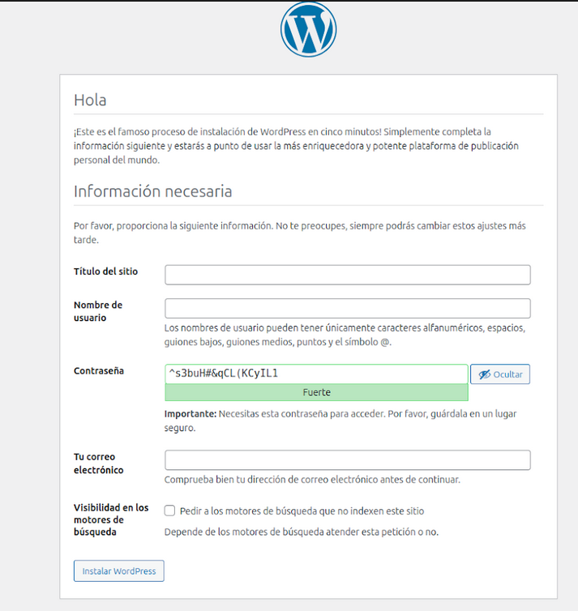

# Instalación de WordPress con Docker

Este documento describe los requisitos y pasos para instalar WordPress usando Docker y Docker compose.

## Requisitos Previos

- Docker Engine instalado 
- Docker Compose instalado 
- 2GB de RAM mínimo
- 10GB de espacio en disco disponible
- Puertos 80 y 443 disponibles en el host

## Estructura del Proyecto

```
wordpress-docker/
├── docker-compose.yml
├── .env
└── wordpress/
    └── wp-content/
```

## Docker

### Instalación de Docker y Docker Compose

forma rápida de instalar docker en ubuntu

```bash
apt update
apt install docker.io
apt install docker-compose

```
> [!NOTE]
> Para instalar Docker de manera oficial [pincha aqui](https://docs.docker.com/engine/install/ubuntu/)

# Verificar la instalación

```bash

docker --version
docker compose version

```

## WordPress con Docker

# 1. Primero crear la red
```bash
docker network create wp_network
```
```bash
docker network ls
```

# 2. Iniciar MySQL
```bash
docker run -d \
--name db \
--network wp_network \
-e MYSQL_ROOT_PASSWORD=wordpress \
-e MYSQL_DATABASE=wordpress \
-e MYSQL_USER=wordpress \
-e MYSQL_PASSWORD=wordpress \
-v mysql_data:/var/lib/mysql \
mysql:latest
```

# 3. Iniciar WordPress
```bash
docker run -d \
--name wordpress \
--network wp_network \
-e WORDPRESS_DB_HOST=db \
-e WORDPRESS_DB_USER=wordpress \
-e WORDPRESS_DB_PASSWORD=wordpress \
-e WORDPRESS_DB_NAME=wordpress \
-p 8080:80 \
-v wordpress_data:/var/www/html \
wordpress:latest
```

# Verificar que los contenedores están corriendo
```bash
docker ps
```

# Ver los logs de MySQL
```bash
docker logs db
docker logs wordpress
```


Ahora nos dirigimos a nuestro navegador y escribimos localhost:8080 o nuestra IP y nos aparecera la pagina de instalacion de wordpress.


# Para borrar todo
```bash
docker stop wordpress db
docker rm wordpress db
docker network rm wp_network
docker volume rm mysql_data wordpress_data
docker stop $(docker ps -a -q)
docker rm $(docker ps -a -q)
docker volume rm -f mysql_data wordpress_data
```


# Docker Compose

#Creamos el fichero .env (se pueden cambiar) y crear el fichero .yml por el puerto 81 para no tener conflictos con apache2
```bash
touch .env
nano .env
```
```bash
MYSQL_ROOT_PASSWORD=wordpress
MYSQL_DATABASE=wordpress
MYSQL_USER=wordpress
MYSQL_PASSWORD=wordpress
WORDPRESS_DB_HOST=db
WORDPRESS_DB_USER=wordpress
WORDPRESS_DB_PASSWORD=wordpress
WORDPRESS_DB_NAME=wordpress
```
```bash
touch docker-compose.yml
nano docker-compose.yml
```
```bash
version: '3.8'

services:
  db:
    image: mysql:5.7    # Cambiado de mysql:8.0 a mysql:5.7 para mejor compatibilidad
    volumes:
      - db_data:/var/lib/mysql
    restart: always
    env_file:
      - .env
    networks:
      - wordpress-network

  wordpress:
    depends_on:
      - db
    image: wordpress:latest
    ports:
      - "8081:80"    # Cambiado de 8080 a 8081 para evitar conflictos con Apache
    restart: always
    volumes:
      - wordpress_data:/var/www/html
    env_file:
      - .env
    networks:
      - wordpress-network

volumes:
  db_data:
  wordpress_data:

networks:
  wordpress-network:
    driver: bridge

```

luego ejecutamos el siguiente comando

```bash
docker-compose up -d
```

Ahora nos dirigimos a nuestro navegador y escribimos localhost:8080 o nuestra IP y nos aparecera la pagina de instalacion de wordpress.




```bash
#Para ver los contenedores
docker ps

#Para ver las redes
docker network ls

# Detener los contenedores
docker-compose down

# Detener los contenedores y eliminar los volúmenes
docker-compose down -v

# Eliminar todo (contenedores, redes, volúmenes)
docker-compose down -v --remove-orphans
```

## Instalación Rápida (Método recomendado)
las variables de entorno se encuentran en el archivo .env y puedes modificarlas según tus necesidades.

1. Clona el repositorio:
   ```bash
   git clone https://github.com/AdrianCE94/WordpressAsCMS
   cd WordpressAsCMS
   docker-compose up -d
    ```
2. Abre tu navegador y accede a `http://localhost:8080` para configurar WordPress.

