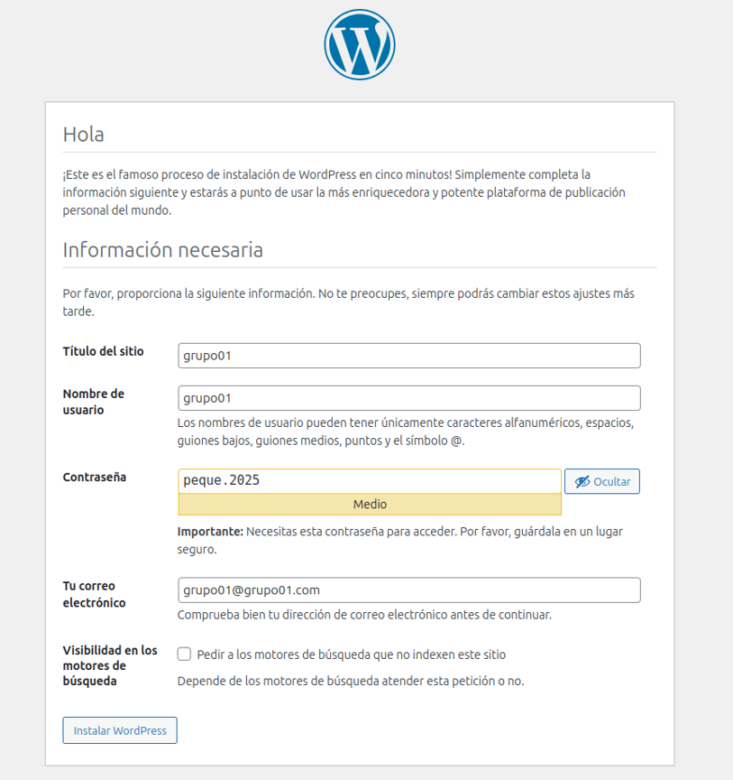
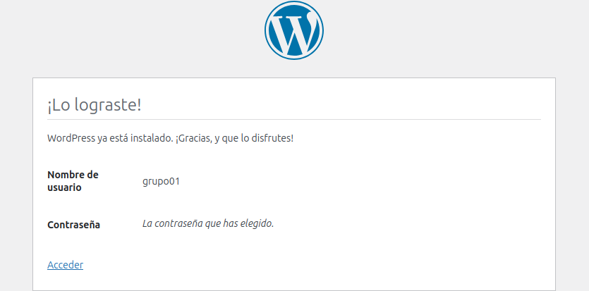
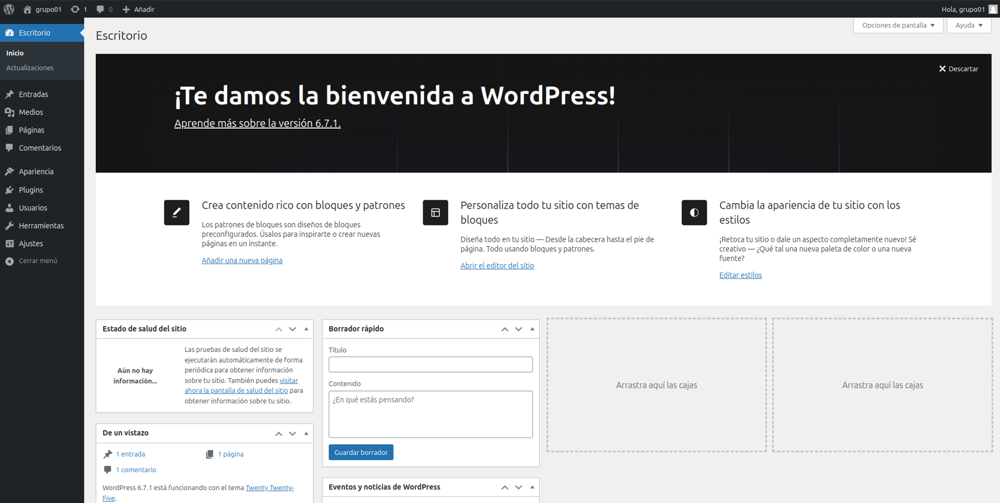

# Instalación de WordPress con Docker

Este documento describe los requisitos y pasos para instalar WordPress usando Docker y Docker compose.

## Requisitos Previos

- Docker Engine instalado 
- Docker Compose instalado 
- 2GB de RAM mínimo
- 10GB de espacio en disco disponible
- Puertos 80 y 443 disponibles en el host

## Estructura del Proyecto

```
wordpress-docker/
├── docker-compose.yml
├── .env
└── wordpress/
    └── wp-content/
```

## Docker

### Instalación de Docker y Docker Compose

forma rápida de instalar docker en ubuntu

```bash
apt update
apt install docker.io
apt install docker-compose
```
> [!NOTE]
> Para instalar Docker de manera completa [pincha aqui](https://docs.docker.com/engine/install/ubuntu/)

Para instalar Docker compose

```bash
apt install docker-compose
```

## WordPress con Docker

```bash
#Crear red
docker network create wordpress-network
```
```bash
#Docker run mysql
docker run -d \
--name grupo01 \
--network wordpress_net \
-e MYSQL_ROOT_PASSWORD=peque \
-e MYSQL_DATABASE=grupos \
-e MYSQL_USER=grupo1 \
-e MYSQL_PASSWORD=peque \
-v mysql_data:/var/lib/mysql \
mysql:latest
```
```bash
#Docker run wordpress 
docker run -d \
--name wp-grupo01 \
--network wordpress_net \
-e WORDPRESS_DB_HOST=grupo01 \
-e WORDPRESS_DB_USER=grupo1 \
-e WORDPRESS_DB_PASSWORD=peque \
-e WORDPRESS_DB_NAME=grupos \
-p 8080:80 \
-v wordpress_data:/var/www/html \
wordpress:latest
```
```bash
#Para ver los contenedores
docker ps
#Para ver las redes
docker network ls
```
Ahora nos dirigimos a nuestro navegador y escribimos localhost:8080 o nuestra IP y nos aparecera la pagina de instalacion de wordpress.





# Docker Compose

```bash